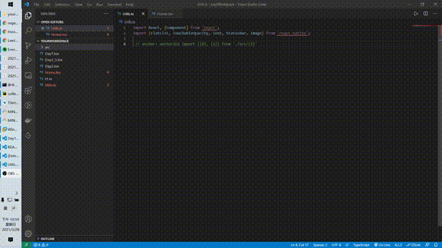

# MagicAnchor
>I need to learn about some Architect things or use better AI to process it.


## Notes

Currently **only support for Windows**.

Please open files by `Open Folder` in vscode.
## Situation

In some cases, you need to add similar text repeatedly. 

For example, you have to type codes to import, export, add configuration and other miscs in several but same files. What you do is just copy, past, and change a little params.

If you keep doing these affairs, chances are you won't MAGA. **Do not repeat yourself!** MagicAnchor can help you get free you from that uncreative status.
## Usage

 
## Grammar

```text
... // your code

// notes: 
// anchor: anchorID your code boilerplate, use {1} {2} to customize your params

... // your code
```


## Requirements

Windows

<!-- ## Extension Settings

Include if your extension adds any VS Code settings through the `contributes.configuration` extension point.

For example:

This extension contributes the following settings:

* `myExtension.enable`: enable/disable this extension
* `myExtension.thing`: set to `blah` to do something

## Known Issues

Calling out known issues can help limit users opening duplicate issues against your extension. -->

## Release Notes

### 0.0.1

Initial release of MagicAnchor


### 0.0.2
- [x] Rename the stupid register name `Hello Word`.
- [x] fixed: auto replace when run first time. 
- [x] Enable ignore files and directory from vscode settings, defaultly ignore directory such as `node_modules`

### 0.0.3 TODO
- [ ] fixed: must reload to update configuration
- [ ] fixed: cannot take effect to ignore on files
- [ ] refactor project

### 0.0.4 TODO 
- [ ] Enable delete, change.
- [ ] Enable select Current File or Whole Working directory


### 0.0.5 TODO
- [ ] Alert modified files
- [ ] Text indentation according to spaces in front of `//`
- [ ] Enable it on Linux  

### 0.0.6 TODO 
- [ ] Support annotation according to files type
- [ ] Index anchor ids on vscode start deamonly
- [ ] Monitor changed files and index them

### 0.0.7 TODO
- [ ] generate boilerplate according to code, see https://github.com/Microsoft/vscode-extension-samples/tree/main/code-actions-sample
### Not Sure
- [ ] Customize directory depth

### problem
- [ ] different params vectors result in too many ids
- [ ] Not very easy to use